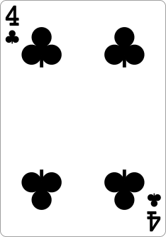

# Truco Paulista



**Truco Paulista** é uma implementação digital do tradicional jogo de cartas brasileiro _Truco Paulista_. Desenvolvido em Python utilizando a biblioteca Pygame, este jogo oferece uma experiência envolvente e interativa, permitindo que os jogadores desafiem um oponente de IA com mecânicas intuitivas de arrastar e soltar e jogabilidade estratégica.

## Índice

- [Características](#características)
- [Instalação](#instalação)
- [Uso](#uso)
- [Estrutura do Projeto](#estrutura-do-projeto)
- [Dependências](#dependências)
- [Recursos](#recursos)
- [Contribuindo](#contribuindo)
- [Licença](#licença)
- [Agradecimentos](#agradecimentos)

## Características

- **Jogabilidade Interativa:** Arraste e solte suas cartas na área de jogo de forma fluida.
- **Oponente de IA:** Jogue contra uma IA inteligente que faz movimentos automaticamente.
- **Níveis de Truco:** Progrida através de múltiplos níveis de _Truco_—Truco, Seis, Nove e Doze.
- **Pontuação Dinâmica:** Pontue pontos com base no resultado de cada rodada e gerencie sua pontuação total para vencer o jogo.
- **Integração de Áudio:** Aproveite a música de fundo e efeitos sonoros para uma experiência imersiva.
- **Código Modular:** Código bem estruturado dividido em módulos para fácil manutenção e escalabilidade.

## Instalação

### Pré-requisitos

- **Python 3.6 ou superior:** Certifique-se de ter o Python instalado no seu sistema. Você pode baixá-lo em [python.org](https://www.python.org/downloads/).

### Clonar o Repositório

```bash
git clone https://github.com/yuri-moraes/truco_paulista.git
cd truco_paulista
```

### Criar um Ambiente Virtual (Opcional, mas Recomendado)

Criar um ambiente virtual ajuda a gerenciar dependências e manter seu projeto isolado.

```bash
python -m venv venv
```

Ative o ambiente virtual:

- **Windows:**

  ```bash
  venv\Scripts\activate
  ```

- **macOS e Linux:**

  ```bash
  source venv/bin/activate
  ```

### Instalar Dependências

Certifique-se de que você tem `pip` instalado e execute:

```bash
pip install -r requirements.txt
```

**Nota:** Se não houver um arquivo `requirements.txt`, você pode instalar as dependências manualmente:

```bash
pip install pygame
```

## Uso

Após completar os passos de instalação, você pode iniciar o jogo executando o script principal.

```bash
python main.py
```

### Instruções de Jogabilidade

1. **Iniciando o Jogo:**

   - Ao iniciar, o jogo exibirá sua mão de cartas e as cartas ocultas do oponente.

2. **Jogando uma Carta:**

   - **Arrastar e Soltar:** Clique e segure uma carta da sua mão, arraste-a para a área de jogo na mesa e solte para jogar.

3. **Mecânica de Truco:**

   - **Pedir Truco:** Clique no botão "Pedir Truco" para aumentar as apostas do jogo. A IA aceitará automaticamente os níveis subsequentes de Truco—Seis, Nove e Doze.
   - **Pontuação:** Os pontos são atribuídos com base no resultado de cada rodada. O primeiro jogador a atingir ou exceder 12 pontos vence o jogo.

4. **Fim do Jogo:**
   - Quando um jogador atinge 12 pontos, o jogo declara o vencedor, reproduz a música correspondente e reinicia automaticamente para um novo jogo.

## Estrutura do Projeto

```
truco_paulista/
├── main.py
├── constants.py
├── resources.py
├── game_logic.py
├── utils.py
├── README.md
├── requirements.txt
├── images/
│   ├── background-img.jpg
│   ├── blank_card.png
│   ├── card1.png
│   ├── card2.png
│   └── ... (outras imagens de cartas)
└── sounds/
    ├── background-music.wav
    ├── winner-song.wav
    ├── looser-song.wav
    └── ... (outras músicas e efeitos sonoros)
```

### Descrição dos Arquivos

- **`main.py`**: Arquivo principal que inicializa o jogo, gerencia o loop principal e coordena as interações entre os módulos.
- **`constants.py`**: Define todas as constantes utilizadas no jogo, como cores, tamanhos de tela, diretórios, ordens de cartas, etc.
- **`resources.py`**: Responsável por carregar imagens e sons do jogo.
- **`game_logic.py`**: Contém funções relacionadas à lógica do jogo, como criação de baralho, determinação de manilhas, valor das cartas e reinício do jogo.
- **`utils.py`**: Funções utilitárias, como desenhar texto na tela.
- **`images/`**: Pasta que contém todas as imagens utilizadas no jogo.
- **`sounds/`**: Pasta que contém todos os arquivos de áudio utilizados no jogo.
- **`README.md`**: Este arquivo.
- **`requirements.txt`**: Lista de dependências Python necessárias para executar o jogo.

## Dependências

O projeto utiliza as seguintes bibliotecas e frameworks:

- **[Pygame](https://www.pygame.org/news)**: Biblioteca Python para desenvolvimento de jogos. Utilizada para gráficos, sons e gerenciamento de eventos.

### Instalando Dependências

As dependências estão listadas no arquivo `requirements.txt`. Para instalar todas as dependências, execute:

```bash
pip install -r requirements.txt
```

**Conteúdo do `requirements.txt`:**

```
pygame>=2.0.0
```

## Recursos

### Imagens

Todas as imagens de cartas e o fundo do jogo estão localizadas na pasta `images/`. Certifique-se de que os arquivos de imagem estejam corretamente nomeados e no formato `.png` ou `.jpg`.

- **`background-img.jpg`**: Imagem de fundo do jogo.
- **`blank_card.png`**: Imagem da carta virada para o oponente.
- **`cardX.png`**: Imagens das cartas do baralho.

### Sons

Todos os arquivos de áudio estão localizados na pasta `sounds/`. Certifique-se de que os arquivos de som estejam no formato `.wav` ou `.mp3`.

- **`background-music.wav`**: Música de fundo que toca durante o jogo.
- **`winner-song.wav`**: Música tocada quando o jogador vence.
- **`looser-song.wav`**: Música tocada quando o jogador perde.
- **Outros efeitos sonoros**: Podem ser adicionados conforme necessário.

## Contribuindo

Contribuições são bem-vindas! Se você deseja melhorar este projeto, siga as etapas abaixo:

1. **Fork o Repositório**
2. **Crie uma Branch para sua Feature (`git checkout -b feature/nova-feature`)**
3. **Commit suas Alterações (`git commit -m 'Adiciona nova feature')`**
4. **Push para a Branch (`git push origin feature/nova-feature`)**
5. **Abra um Pull Request**

Por favor, certifique-se de seguir as melhores práticas de codificação e manter a consistência do código existente.

## Licença

Este projeto está licenciado sob a [MIT License](LICENSE).

## Agradecimentos

- [Pygame](https://www.pygame.org/) - Biblioteca utilizada para o desenvolvimento do jogo.
- [Freesound](https://freesound.org/) - Fonte de recursos sonoros utilizados no jogo.
- [GitHub](https://github.com/) - Plataforma para hospedagem do código-fonte.

---

**Desenvolvido com ❤️ por [Yuri Moraes](https://github.com/yuri-moraes)**
